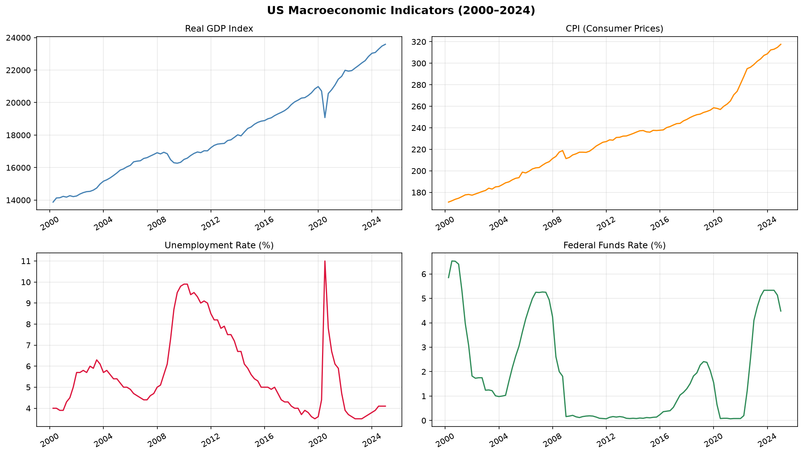

# Macroeconomic Forecasting & Policy Research

This project is a Python-based macroeconomic forecasting engine that builds, validates, and compares models for forecasting key macro variables — GDP growth, inflation, unemployment, and interest rates. Includes train-test backtesting, scenario analysis with fan charts, and a Diebold-Mariano test for statistical significance.

---

## Results

### Model Comparison (RMSE — lower is better)

| Variable | RW RMSE | VAR RMSE | Improvement % | DM Statistic | p-value | Stat. Significance |
|---|---|---|---|---|---|---|
| Real GDP       | 2.6415 | 2.5629 | 3.0 | -0.8125 | 0.4266 | No |
| CPI            | 1.3144 | 0.9615 | 26.8 | -4.0786 | 0.0006 | Yes |
| Unemployment   | 35.3066 | 35.0438 | 0.7 | -0.8627 | 0.399 | No |
| Fed Funds Rate | 123.6874 | 122.6876 | 0.8 | -2.1874 | 0.0414 | Yes |


---

### Charts

**Macro Overview — All 4 Indicators (2000–2024)**



---

**VAR Model — Forecast vs Actual (Test Period)**


---

**Scenario Fan Charts — Baseline, Upside & Downside**


---

**GDP Scenario Chart (Report-Ready)**


---

**Diebold-Mariano Test Results**


---

## Models

### 1. Random Walk (Benchmark)
Predicts next quarter = current quarter. No learning, no parameters. Every other model is judged against this.

### 2. AR(4) — AutoRegressive Model
Forecasts each variable using its own last 4 quarters. Single-variable, simple, interpretable.

```
GDP(t) = α + β₁·GDP(t-1) + β₂·GDP(t-2) + β₃·GDP(t-3) + β₄·GDP(t-4) + ε
```

### 3. VAR — Vector AutoRegression
Forecasts all four variables simultaneously. Each variable depends on the recent history of all other variables, capturing macro interdependencies (e.g. how an interest rate shock feeds into unemployment).

```
Y(t) = A₁·Y(t-1) + A₂·Y(t-2) + ... + Aₚ·Y(t-p) + ε
```
Lag order selected automatically using AIC.

---

## Scenario Analysis

Three forecast paths are produced over the test horizon:

| Scenario | Assumption | GDP shock | CPI shock |
|---|---|---|---|
| **Baseline** | Model forecast, no additional shock | — | — |
| **Upside** | Positive productivity shock | +1.5% | -0.3% |
| **Downside** | Stagflation / oil price spike | -2.0% | +1.5% |

Shocks phase in linearly over 4 quarters to simulate gradual transmission.

---

## Statistical Validation

### Diebold-Mariano Test
The DM test (Diebold & Mariano, 1995) tests whether the difference in forecast accuracy between the VAR and Random Walk is statistically significant or could be due to chance.

- **H₀**: VAR and Random Walk have equal predictive accuracy
- **H₁**: VAR is significantly more accurate
- **Rejection threshold**: p-value < 0.05

A negative DM statistic means the VAR has lower forecast loss than the Random Walk. 

---

## Data Sources

| Dataset | Source | Frequency | Variables |
|---|---|---|---|
| US Real GDP | FRED (`GDPC1`) | Quarterly | GDP index |
| US CPI | FRED (`CPIAUCSL`) | Monthly → Quarterly | Consumer prices |
| US Unemployment | FRED (`UNRATE`) | Monthly → Quarterly | Unemployment rate |
| Federal Funds Rate | FRED (`FEDFUNDS`) | Monthly → Quarterly | Policy interest rate |
| India GDP Growth | World Bank (`NY.GDP.MKTP.KD.ZG`) | Annual → Quarterly | GDP growth % |
| India Inflation | World Bank (`FP.CPI.TOTL.ZG`) | Annual → Quarterly | CPI % |
| India Unemployment | World Bank (`SL.UEM.TOTL.ZS`) | Annual → Quarterly | Unemployment % |


---

## Key References

- Diebold, F.X. and Mariano, R.S. (1995). *Comparing Predictive Accuracy*. Journal of Business & Economic Statistics.
- Sims, C.A. (1980). *Macroeconomics and Reality*. Econometrica. *(Original VAR paper)*
- Stock, J.H. and Watson, M.W. (2001). *Vector Autoregressions*. Journal of Economic Perspectives.

---

## Author

**Kartik Badesara**
[github.com/KartikBadesara](https://github.com/KartikBadesara)

---


