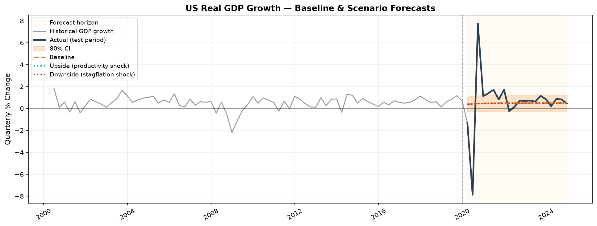
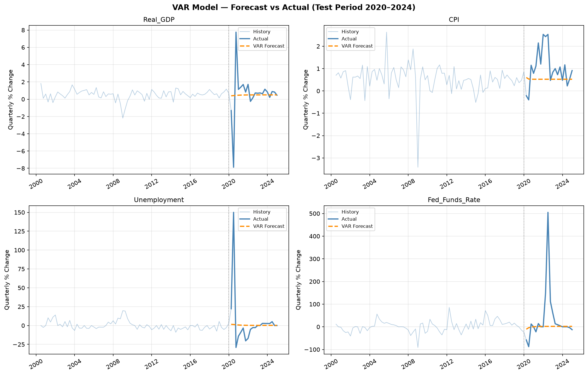
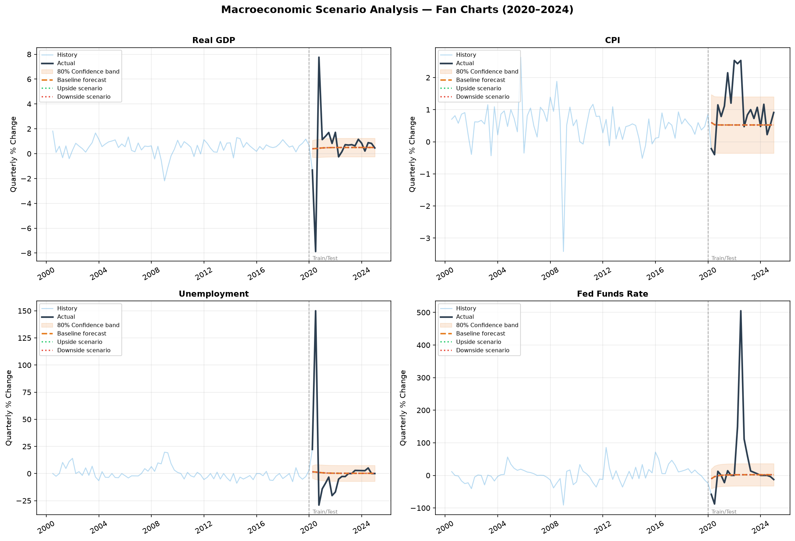
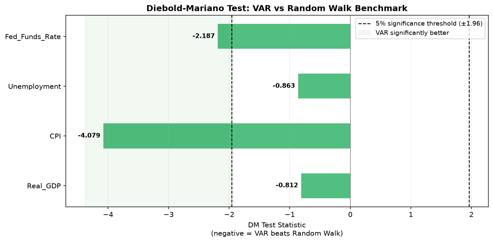

# Macro Forecasting Research

This is a Python-based macroeconomic forecasting project that builds, validates, and compares models for forecasting key US macro variables: GDP growth, inflation, unemployment, and the federal funds rate. Includes train-test backtesting, scenario analysis with fan charts, and a Diebold-Mariano test for statistical significance.

---


---

## What this project does

1. Pulls data from FRED for GDP, CPI, unemployment, and the Fed funds rate (2000-2024)
2. Builds three models: Random Walk benchmark, AR(4), and VAR
3. Backtests on pre-2020 training data, evaluates on 2020-2024 test data (includes the COVID shock)
4. Runs a Diebold-Mariano test to statistically verify whether the VAR beats the benchmark
5. Produces scenario forecasts: baseline, upside, and downside paths with 80% confidence bands

---

## Results

### Model Comparison (RMSE - lower is better)

| Variable | RW RMSE | VAR RMSE | Improvement % | DM Statistic | p-value | Stat. Significant? |
|---|---|---|---|---|---|---|
| Real GDP | - | - | - | - | - | - |
| CPI | - | - | - | - | - | - |
| Unemployment | - | - | - | - | - | - |
| Fed Funds Rate | - | - | - | - | - | - |


### Charts

**GDP Scenario Forecast**



**VAR Model - Forecast vs Actual**



**Scenario Fan Charts**



**Diebold-Mariano Test Results**



---

## Models

### 1. Random Walk (Benchmark)

Predicts next quarter = current quarter. No learning, no parameters. Every other model is judged against this.

### 2. AR(4) - AutoRegressive Model

Forecasts each variable using its own last 4 quarters. Single-variable, simple, interpretable.

```
GDP(t) = a + b1*GDP(t-1) + b2*GDP(t-2) + b3*GDP(t-3) + b4*GDP(t-4) + e
```

### 3. VAR - Vector AutoRegression

Forecasts all four variables simultaneously. Each variable depends on the recent history of all other variables, capturing macro interdependencies (e.g. how an interest rate shock feeds into unemployment).

```
Y(t) = A1*Y(t-1) + A2*Y(t-2) + ... + Ap*Y(t-p) + u(t)
```


---

## Scenario Analysis

Three forecast paths are produced over the test horizon:

| Scenario | Assumption | GDP shock | CPI shock |
|---|---|---|---|
| Baseline | Model forecast, no additional shock | - | - |
| Upside | Positive productivity shock | +1.5% | -0.3% |
| Downside | Oil price spike / stagflation | -2.0% | +1.5% |

Shocks phase in linearly over 4 quarters to simulate gradual transmission.

---

## Statistical Validation

### Diebold-Mariano Test

The DM test (Diebold and Mariano, 1995) tests whether the difference in forecast accuracy between the VAR and Random Walk is statistically significant or could be due to chance.

- H0: VAR and Random Walk have equal predictive accuracy
- H1: VAR is significantly more accurate
- Rejection threshold: p-value < 0.05

A negative DM statistic means the VAR has lower forecast loss than the Random Walk. 

---

## Data Sources

| Dataset | Source | Frequency | Variable |
|---|---|---|---|
| US Real GDP | FRED (GDPC1) | Quarterly | GDP index |
| US CPI | FRED (CPIAUCSL) | Monthly to Quarterly | Consumer prices |
| US Unemployment | FRED (UNRATE) | Monthly to Quarterly | Unemployment rate |
| Federal Funds Rate | FRED (FEDFUNDS) | Monthly to Quarterly | Policy interest rate |


---


---

## Key References

- Diebold, F.X. and Mariano, R.S. (1995). Comparing Predictive Accuracy. Journal of Business and Economic Statistics.
- Sims, C.A. (1980). Macroeconomics and Reality. Econometrica.
- Stock, J.H. and Watson, M.W. (2001). Vector Autoregressions. Journal of Economic Perspectives.

---

## Author

Kartik Badesara
github.com/KartikBadesara

---

